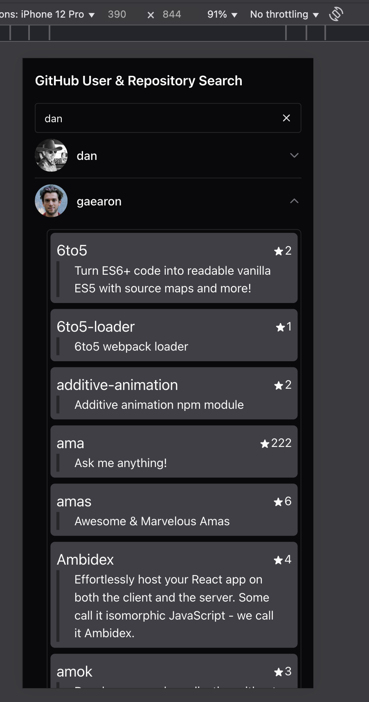
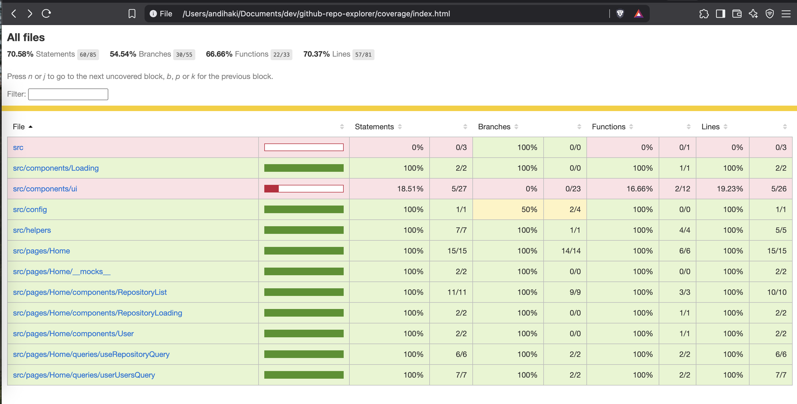

# React + TypeScript + Vite + MSW + Chakra UI

## Bootstrapping

In the project directory, install all express server and react dependencies:

```zsh
yarn install
```

## Environment variables

```bash
cp .env.example .env.local
```

fill in env

## run apps

run:

```zsh
yarn dev
```

## Unit Testing

run:

```zsh
yarn test:watch
```

or with coverage:

```zsh
yarn test
```

# Apps Sample

## Apps



## Video demo


## Unit Test Coverage


